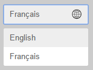

# Premade ui components for akryum:vue-i18n

Key-in-hand vue components for [akryum:vue-i18n](https://github.com/Akryum/meteor-vue-component/tree/master/packages/vue-i18n)

## Installation

    meteor add akrym:vue-i18n-ui


## Language selector



### Usage

Import the component in yours:

```javascript
import {LocaleSelect} from 'meteor/akryum:vue-i18n-ui';

export default {
  components: {
    LocaleSelect
  }
}
```

Or register it as a global component:

```javascript
import {LocaleSelect} from 'meteor/akryum:vue-i18n-ui';
Vue.component('locale-select', LocaleSelect);
```

Then use it in your component template:

```html
<locale-select></locale-select>
```

### Properties

Template | Default | Description
--- | --- | ---
`prompt-remember` | `true` | (Boolean) When the user selects a language, open a dialog asking if the choice must be saved.
`use-native-names` | `true` | (Boolean) Show the language names in their native form or use the english names.


### Slots

You can customize the default icon using [vue slots](http://vuejs.org/guide/components.html#Content-Distribution-with-Slots). The following slot is available:

```html
<locale-select class="lang-select">
  <!-- This slot will override the default icon html code -->
  <span slot="arrow">v</span>
</locale-select>
```

### Localize the components

In your own *locale files*, add the following strings and translate them:

```json
"packages": {
  "akryum_vue_i18n_ui": {
    "info": "Do you want to remember your choice?",
    "yes": "Yes",
    "no": "No"
  }
}
```
